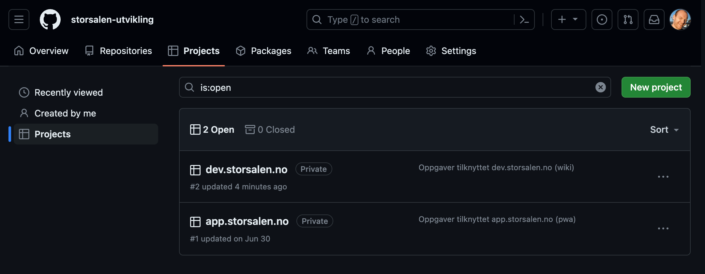
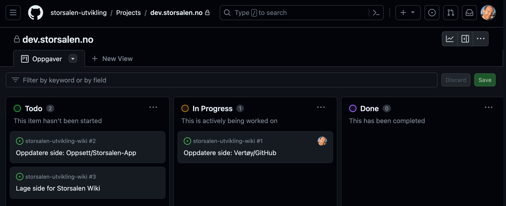
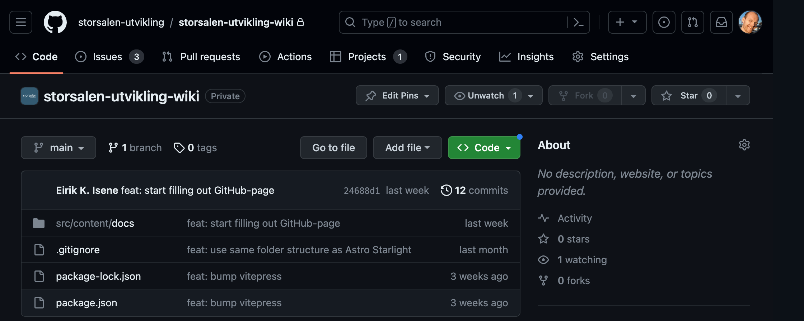

# GitHub

I Storsalen Utvikling bruker vi [GitHub][GitHubHome] som plattform for versjonskontroll og samarbeid om kildekode.
_**GitHub**_ må ikke forveksles med _**git**_, hvor _**git**_ er en teknologi for versjonskontroll og _**GitHub**_ er en
plattform som
"hoster" kildekode ved hjelp av _**git**_-teknologien. Nedenfor følger info om hvordan vi bruker de forskjellige tingene
GitHub har å by på, til slutt vil det være en liten guide for å sette opp **_git_** på maskinen din og noen gode tips og
triks.

## Projects

GitHub har såkalte _**projects**_ som lar oss organisere arbeid på en god og oversiktlig måte. Du finner pågående
prosjekter [her](https://github.com/orgs/storsalen-utvikling/projects) (du må være logget inn), og det vil se omtrent
sånn her ut:

Her kommer vi til å opprette prosjekter for hver ting vi jobber med i Storsalen Utvikling (som for øyeblikket bare er
Wiki og Appen). Hvis vi går videre inn på et prosjekt, for eksempel **dev.storsalen.no** (_wiki_), så får vi opp et
**_board_** med oversikt over planlagte, påbegynte og ferdige oppgaver:

Her er det bare å følge med, og ta tak i de oppgavene som du tror du kan få til. Ved å trykke videre inn på oppgavene
kan man sette seg selv opp som _Assignee_ og etter hvert koble oppgaven til en _Pull Request_ når koden er ferdig
utviklet og skal gjennomgå kontroll av andre i teamet. Det er også mulig å kommentere på en oppgave hvis man har
innspill til hvordan den best kan løses.

::: tip Håndbok for utvikling
Mer info om arbeidsprosessen for hvert prosjekt finner du under på prosjektsidene her på wikien.
:::

## Repositories

GitHub _**repositories**_ brukes for å lagre og samarbeide om kildekode. Du finner alle våre
_**repositories**_ [her](https://github.com/orgs/storsalen-utvikling/repositories) (du må være logget inn). Hvis du
klikker videre inn på et prosjekt (f.eks. _storsalen-utvikling-wiki_) vil du komme til kildekoden, det ser omtrent sånn
her ut:

Langs den øverste fanen her er det en del nyttige snarveier:

1. _**Issues**_ som lister opp alle oppgaver som er tilknyttet denne koden.
2. _**Pull requests**_ hvor vi gjennomgår hverandres kode før det inkluderes i _main_
3. _**Projects**_ som viser hvilke prosjekter koden er tilknyttet

Lenger ned på siden kan man velge hvilken _**branch**_ av koden man ønsker å se på (her ser vi på _main_). Lenger til
høyre kan man trykke på _**Code**_ for å klone ned koden og begynne å jobbe.

_**Git**_ er industristandarden for versjonskontroll av kode, så selv om det kan være krevende å lære seg å bruke det
effektivt så er det verdt å bruke tiden på det. Det er også veldig mange som bruker _**GitHub**_ som plattform for
_**git**_, så her kan du lære mye om hvordan utvikling foregår ute i den virkelige verden.

## Oppsett

Det første du må gjøre er å installere _**git**_ på din maskin, det finner du [her](https://git-scm.com/). Du finner en
hel bok om git [her](https://git-scm.com/book/en/v2/Getting-Started-About-Version-Control) som forklarer ting godt, men
for oppsett kan du hoppe frem til kapittelet
om [First-Time Git Setup](https://git-scm.com/book/en/v2/Getting-Started-First-Time-Git-Setup) og følge stegene. For å
slippe å skrive brukernavn og passord hver gang du skal kjøre `git pull` og `git push` kan det være nyttig å benytte
_SSH_. Oppsett av _SSH_ kan gjøres [her](https://github.com/settings/keys), der er det også linket til en guide som kan
følges hvis du ikke er kjent med dette fra før.

[GitHubHome]: https://www.github.com