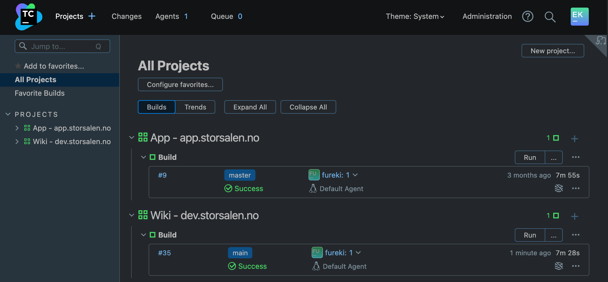

# TeamCity

I Storsalen Utvikling bruker vi [TeamCity][TeamCityHome] som bygg-server, vår instans finner du
på [bygg.storsalen.no][TeamCityStorsalen]. En bygg-server er et verktøy som brukes for å enkelt og automatisk bygge,
teste og publisere, kode. Både [Storsalen-Appen](https://app.storsalen.no) og
[Storsalen Utvikling Wiki](https://dev.storsalen.no) blir oppdatert
herifra hver gang det kommer inn endringer.

## Prosjekter

Når du først logger på [bygg.storsalen.no][TeamCityStorsalen] kommer du til en oversikt over de forskjellige
**_prosjektene_** vi har satt opp, denne ser slik ut:

Her ser du nylige bygg som er kjørt for de forskjellige **_prosjektene_** med litt info om hvor lang tid det tok, om de
var vellykket, når de ble kjørt, osv. Her har du også muligheten til å kjøre nye bygg ved å trykke på _Run_. Hvis du
ønsker å sette opp et nytt **_prosjekt_**, så finner du knappen for det i øverst høyre hjørne.

::: danger NB!
Nye brukere har ikke tilgang til å opprette og endre på eksisterende prosjekter. Sånn har vi det for å ha en viss
kontroll på hva som foregår, og sørge for at de som gjør endringer vet hva de driver med. Dersom du ønsker å lære mer om
TeamCity og bli en administrator for en eller flere prosjekter, ta kontakt med **_Eirik Klungland Isene_**, så tar vi
det derfra!
:::

[TeamCityHome]: https://www.jetbrains.com/teamcity/

[TeamCityStorsalen]: https://bygg.storsalen.no/